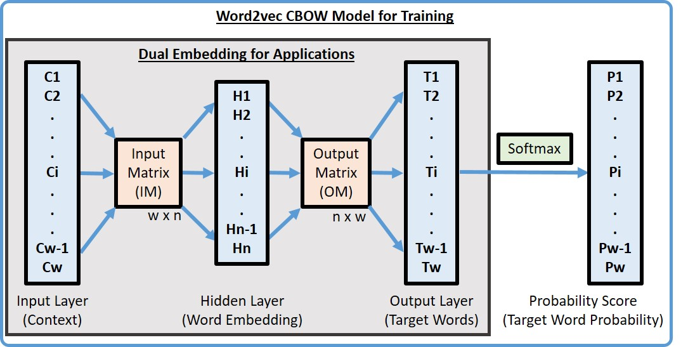
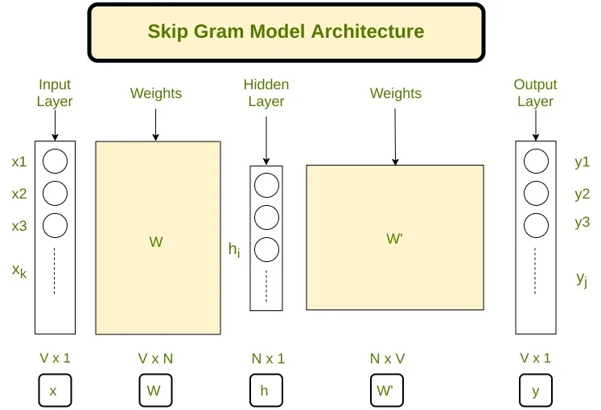
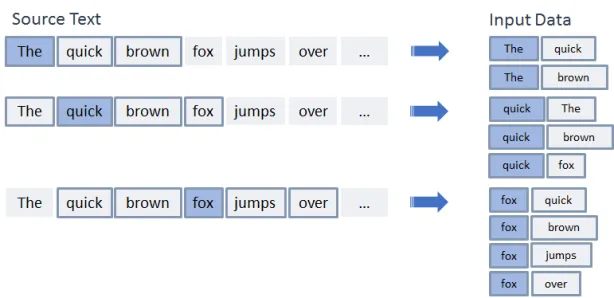

# Word2vec

a method to efficiently create word embeddings. It's used to creating recommendation engines and making sense of sequential data even in commercial, non-language tasks.

## Text conversion
Since the computer is only capable of working on number. Any human language must be translate into number in order for the computer to understand and operated on them using mathematic method. Hence, the text is encoded into numbers after the computer operated on the text it is then decoded back into text that human can understand.

## Embeddings (meaning)
A technique to find the similiarity of meaning of words to have similar representation.
feature of the technique:


- The meaning are learn from training from large amount of text
- Use a single learned vector to hold all values
A word may have multiple meanings e.g. king mean power,man,... all these meanings are put into a vector represent "king".


 *[ 0.50451 , 0.68607 , -0.59517 , -0.022801, 0.60046 , -0.13498 , -0.08813 , 0.47377 , -0.61798 , -0.31012 , -0.076666, 1.493 , -0.034189, -0.98173 , 0.68229 , 0.81722 , -0.51874 , -0.31503 , -0.55809 , 0.66421 , 0.1961 , -0.13495 , -0.11476 , -0.30344 , 0.41177 , -2.223 , -1.0756 , -1.0783 , -0.34354 , 0.33505 , 1.9927 , -0.04234 , -0.64319 , 0.71125 , 0.49159 , 0.16754 , 0.34344 , -0.25663 , -0.8523 , 0.1661 , 0.40102 , 1.1685 , -1.0137 , -0.21585 , -0.15155 , 0.78321 , -0.91241 , -1.6106 , -0.64426 , -0.51042 ]*

- And different from one-hot encoding technique where mulitple dimensions matricies is required to represent word.
- representation is based on usage e.g. similar way of usage result in similar representation in contrast with bag-of-word method which require explicit managing.
- Back by theory in Linguistic “distributional hypothesis” by Zellig Harris 


### OneHot Encoding
One-Hot Encoding is one of the most widely used encoding methods in ML models. This technique is used to quantify categorical data where it compares each level of the categorical variable to a fixed reference level. It converts a single variable with n observations and x distinct values, to x binary variables with n observations where each observation denotes 1 as present and 0 as absent of the dichotomous binary variable.

## Embedding Layer

Before a word can add to the vector it must be:
- One-hot encodable so it can be mapped to the vector
- Vector size is specified
- Vector is randomly initialized

## CBOW (Continous Bag-of-Words)


 An architecture for creating word embeddings that uses $n$
 future words as well as $n$ past words to create a word embedding. 
 $$J_0 = \frac{1}{T}\sum_{t=1}^{T}log\space p(w_t|w_{t-n},...,w_{t-1},w_{t+1},...,w_{t+n})$$
The method is using the distributed representations of context (or surrounding words) are combined to predict the word in the middle of the sliding window.

If we have 4 context words used for predicting one target word the input layer will be in the form of four 1XW input vectors. These input vectors will be passed to the hidden layer where it is multiplied by a WXN matrix. Finally, the 1XN output from the hidden layer enters the sum layer where an element-wise summation is performed on the vectors before a final activation is performed and the output is obtained. 


It's a simple technique of using a single hidden layer to predict a target word at the output layer from a given context in the input layer.
Two matrices, the input matrix I and output matrix O, are used to calculate the hidden layer H = C x I where C is the input vector,w is total words in the corpus,n is the dimension of hidden layer, and target words T = H x O. Finally, the softmax function is used to output the probability value between 0-1.

$$H_{1\times n} = C_{1\times w} \times M_{w\times n}$$
$$T_{1\times w} = H_{1\times n} \times O_{n\times w}$$


**The speed of transmission is an important point of difference between the two viruses. Influenza has a shorter median incubation period (the time from infection to appearance of symptoms) and a shorter serial interval (the time between successive cases) than COVID-19 virus. The serial interval for COVID-19 virus is estimated to be 5-6 days, while for influenza virus, the serial interval is 3 days. This means that influenza can spread faster than COVID-19. 

Further, transmission in the first 3-5 days of illness, or potentially pre-symptomatic transmission –transmission of the virus before the appearance of symptoms – is a major driver of transmission for influenza. In contrast, while we are learning that there are people who can shed COVID-19 virus 24-48 hours prior to symptom onset, at present, this does not appear to be a major driver of transmission. 

The reproductive number – the number of secondary infections generated from one infected individual – is understood to be between 2 and 2.5 for COVID-19 virus, higher than for influenza. However, estimates for both COVID-19 and influenza viruses are very context and time-specific, making direct comparisons more difficult.**


### Implementation of CBOW

```python
import numpy as np
import keras.backend as K
from keras.models import Sequential
from keras.layers import Dense, Embedding, Lambda
from keras.utils import np_utils
from keras.preprocessing import sequence
from keras.preprocessing.text import Tokenizer
import gensim
data=open('/content/gdrive/My Drive/covid.txt','r')
corona_data = [text for text in data if text.count(' ') >= 2]
vectorize = Tokenizer()
vectorize.fit_on_texts(corona_data)
corona_data = vectorize.texts_to_sequences(corona_data)
total_vocab = sum(len(s) for s in corona_data)
word_count = len(vectorize.word_index) + 1
window_size = 2

def cbow_model(data, window_size, total_vocab):
    total_length = window_size*2
    for text in data:
        text_len = len(text)
        for idx, word in enumerate(text):
            context_word = []
            target   = []            
            begin = idx - window_size
            end = idx + window_size + 1
            context_word.append([text[i] for i in range(begin, end) if 0 <= i < text_len and i != idx])
            target.append(word)
            contextual = sequence.pad_sequences(context_word, total_length=total_length)
            final_target = np_utils.to_categorical(target, total_vocab)
            yield(contextual, final_target) 
```
Finally, it is time to build the neural network model that will train the CBOW on our sample data.

```python
model = Sequential()
model.add(Embedding(input_dim=total_vocab, output_dim=100, input_length=window_size*2))
model.add(Lambda(lambda x: K.mean(x, axis=1), output_shape=(100,)))
model.add(Dense(total_vocab, activation='softmax'))
model.compile(loss='categorical_crossentropy', optimizer='adam')
for i in range(10):
    cost = 0
    for x, y in cbow_model(data, window_size, total_vocab):
        cost += model.train_on_batch(contextual, final_target)
    print(i, cost)
```
after training create a file that contains all the vectors.

```python
dimensions=100
vect_file = open('/content/gdrive/My Drive/vectors.txt' ,'w')
vect_file.write('{} {}\n'.format(total_vocab,dimensions))

weights = model.get_weights()[0]
for text, i in vectorize.word_index.items():
    final_vec = ' '.join(map(str, list(weights[i, :])))
    vect_file.write('{} {}\n'.format(text, final_vec))
vect_file.close()

```
use the vectors that were created and use them in the gensim model.

```python
cbow_output = gensim.models.KeyedVectors.load_word2vec_format('/content/gdrive/My Drive/vectors.txt', binary=False)
cbow_output.most_similar(positive=['virus'])
```

## Skip-Gram

Predict the context word for a given target word the reverse of CBOW algorithm.

- It uses a hidden layer to performs the dot product between the weight matrix and the input vector w(t). 

- There normally using 2 layers of neural network
- These outputs is then become input to another dot product operation
- The prediction error is used to modified the weights using backpropagation.
- The final output is input to softmax function to output probability vector
- There is no activation function involve at all.



#### Implementing skipgram
Let's define some variables :

V    Number of unique words in our corpus of text ( Vocabulary )
x    Input layer nx1 (One hot encoding of our input word ).
N    Number of neurons in the hidden layer of neural network
W    Weights matrix vxn between input layer and hidden layer
W'   Weights matrix nxv between hidden layer and output layer
y    A softmax output vx1 layer having probabilities of every word in our vocabulary
T    the transpose
h    hidden vector nx1

$$softmax = \frac{e^{(x_i - max(x_i))}}{\sum_{i=1}^{n} e^{(x_i - max(x_i))}}$$
$$h = W^T\cdot x$$
$$u = W^{\prime T} \cdot h$$


```python
import numpy as np
import string
from nltk.corpus import stopwords

def softmax(x):
	"""Compute softmax values for each sets of scores in x."""
	e_x = np.exp(x - np.max(x))
	return e_x / e_x.sum()

class word2vec(object):
	def __init__(self):
		self.N = 10
		self.X_train = []
		self.y_train = []
		self.window_size = 2
		self.alpha = 0.001
		self.words = []
		self.word_index = {}

	def initialize(self,V,data):
		self.V = V
		self.W = np.random.uniform(-0.8, 0.8, (self.V, self.N))
		self.W' = np.random.uniform(-0.8, 0.8, (self.N, self.V))
		
		self.words = data
		for i in range(len(data)):
			self.word_index[data[i]] = i

	def feed_forward(self,X):
		self.h = np.dot(self.W.T,X).reshape(self.N,1)
		self.u = np.dot(self.W'.T,self.h)
		#print(self.u)
		self.y = softmax(self.u)
		return self.y
		
	def backpropagate(self,x,t):
		e = self.y - np.asarray(t).reshape(self.V,1)
		# e.shape is V x 1
		dLdW1 = np.dot(self.h,e.T)
		X = np.array(x).reshape(self.V,1)
		dLdW = np.dot(X, np.dot(self.W',e).T)
		self.W' = self.W' - self.alpha*dLdW1
		self.W = self.W - self.alpha*dLdW
		
	def train(self,epochs):
		for x in range(1,epochs):	
			self.loss = 0
			for j in range(len(self.X_train)):
				self.feed_forward(self.X_train[j])
				self.backpropagate(self.X_train[j],self.y_train[j])
				C = 0
				for m in range(self.V):
					if(self.y_train[j][m]):
						self.loss += -1*self.u[m][0]
						C += 1
				self.loss += C*np.log(np.sum(np.exp(self.u)))
			print("epoch ",x, " loss = ",self.loss)
			self.alpha *= 1/( (1+self.alpha*x) )
			
	def predict(self,word,number_of_predictions):
		if word in self.words:
			index = self.word_index[word]
			X = [0 for i in range(self.V)]
			X[index] = 1
			prediction = self.feed_forward(X)
			output = {}
			for i in range(self.V):
				output[prediction[i][0]] = i
			
			top_context_words = []
			for k in sorted(output,reverse=True):
				top_context_words.append(self.words[output[k]])
				if(len(top_context_words)>=number_of_predictions):
					break
	
			return top_context_words
		else:
			print("Word not found in dictionary")

def preprocessing(corpus):
	stop_words = set(stopwords.words('english'))
	training_data = []
	sentences = corpus.split(".")
	for i in range(len(sentences)):
		sentences[i] = sentences[i].strip()
		sentence = sentences[i].split()
		x = [word.strip(string.punctuation) for word in sentence
									if word not in stop_words]
		x = [word.lower() for word in x]
		training_data.append(x)
	return training_data
	

def prepare_data_for_training(sentences,w2v):
	data = {}
	for sentence in sentences:
		for word in sentence:
			if word not in data:
				data[word] = 1
			else:
				data[word] += 1
	V = len(data)
	data = sorted(list(data.keys()))
	vocab = {}
	for i in range(len(data)):
		vocab[data[i]] = i
	
	#for i in range(len(words)):
	for sentence in sentences:
		for i in range(len(sentence)):
			center_word = [0 for x in range(V)]
			center_word[vocab[sentence[i]]] = 1
			context = [0 for x in range(V)]
			
			for j in range(i-w2v.window_size,i+w2v.window_size):
				if i!=j and j>=0 and j<len(sentence):
					context[vocab[sentence[j]]] += 1
			w2v.X_train.append(center_word)
			w2v.y_train.append(context)
	w2v.initialize(V,data)

	return w2v.X_train,w2v.y_train

corpus = ""
corpus += "The earth revolves around the sun. The moon revolves around the earth"
epochs = 1000

training_data = preprocessing(corpus)
w2v = word2vec()

prepare_data_for_training(training_data,w2v)
w2v.train(epochs)

print(w2v.predict("around",3))

```

## Word2Vec
A word embedding technique that is used to convert the words in the dataset to vectors so that the machine understands. Each unique word in your data is assigned to a vector and these vectors vary in dimensions depending on the length of the word. 

A statistical method for efficiently learning a standalone word embedding from a text corpus by analyze and math to exploit the "man-ness" from word "King" and "woman-ness" from word "Queen" to come up with "King is to queen as man to woman"
to capture the semantic of the language.
- The offset, angle between vector represent relationship between word e.g. "King-Man+woman = queen"
- Allow others technique that focus on word usage location in predefind context sliding window of neighboring words to be used 
    - Continous Bag-of-Words CBOW model e.g. predict current word based on context
    - Continous Skip-Gram model e.g. predict surrounding words based on current word


- Have high efficiency of both space and time of computation allow the larger data set to be used

## Algorithm

### GloVe (Global Vectors for Word Representation)
An approach that combine global statistics of matrix factorization (LSA Latent Semantic Analysis) with local context base learning for use with Word2vec.
It uses the method of create explicit word-context matrix using statistic across the whole corpus.

### Using Embedding

1. Standalone
    Train the model on embedding alone separately from other task and then use the model as part of other task
2. Jointly
    Train the model to learn embedding as part of other task which later used for only this model.
### Pretrain Embedding
There are many freely available pretrained embedding model that can directly plug-in to your model
1. Static
    When a pretrained model has a good fit with your task it can be a direct component of your model
2. Updated
    When the pretrained embedding is seeded as parted of the model that will be updating during model training.
